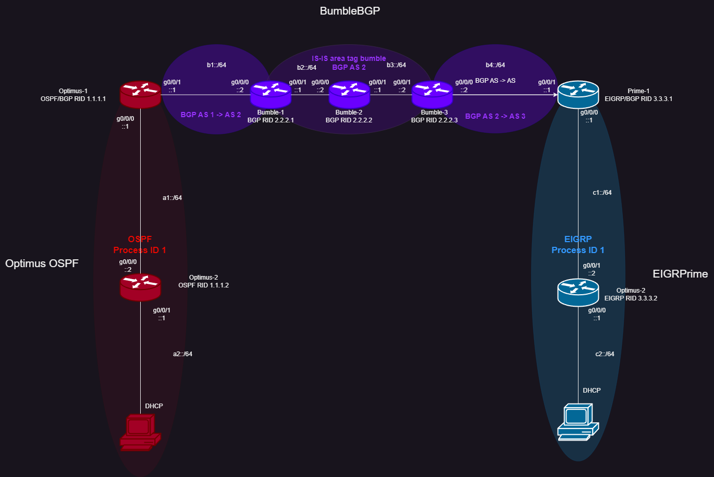
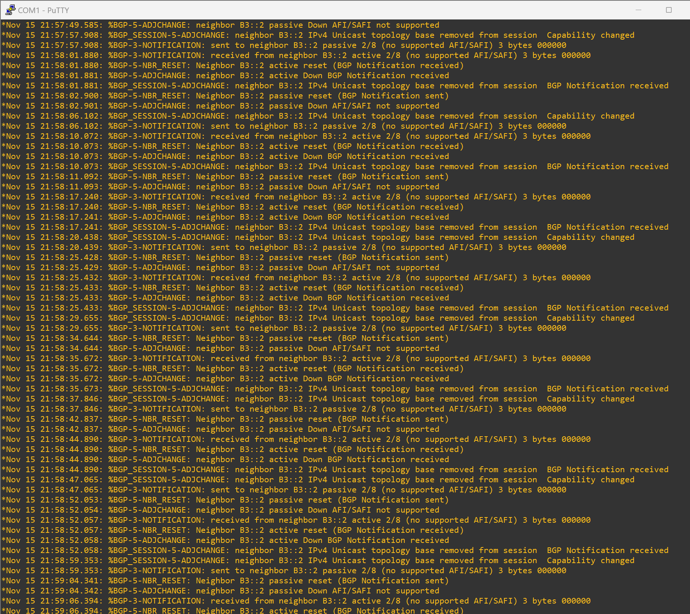
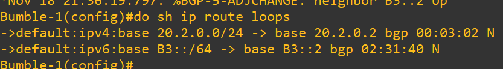

# Advanced Cisco Networking Academy: Designing a Multiprotocol Network with Internal/External BGP
## Purpose
This lab is intended to expand upon our knowledge of the BGP routing protocol by teaching the internal variation of the protocol. It adds an extra layer of difficulty by peering two iBGP-enabled routers that aren’t directly connected. The lab also tests previously taught skills such as how to implement eBGP and how to connect BGP to other routing protocols such as OSPF, IS-IS, and EIGRP.
## Background
Border Gateway Protocol, or BGP, is a routing protocol used to exchange routers in between routers on internal networks and on the internet. It was developed in 1989 by the Internet Engineering Task Force, or IETF, a group that develops standards and operates under the Internet Society non-profit organization. BGP for IPv4 was originally specified in RFC 1105, and BGP for IPv6 was originally specified in RFC 1654. The most recent version of the protocol, BGP-4, is specified in RFC 4271. 
BGP uses TCP connections between routers on port 179 and sends hello messages every 30 seconds by default. Internal BGP, or iBGP, sends routing information between routers in the same autonomous system, while external BGP, or eBGP, sends information between autonomous systems. Confusingly, eBGP sounds very similar to EGP, or Exterior Gateway Protocol, which is the predecessor to BGP. BGP is mainly designed to allow routers managed by different companies to exchange routes with each other, which is why eBGP is much more commonly used than iBGP.  
A helpful characteristic of BGP is that BGP-enabled routers can peer with each other even if they aren’t directly connected. As long as the routers have a route to each other, they can become BGP neighbors irrelevant of the number of hops between them. 
BGP routers go through 6 exchange states: Idle, Connect, Active, OpenSent, OpenConfirm, and Established. By default, if the protocol is given multiple routes to a destination, it will count the number of AS jumps to the destination between each route and use the route with the lowest number. 
One of BGP’s major vulnerabilities is that routers, by default, BGP-enabled routers will put any advertised routes into the routing table. While this is normally useful, it also leaves routers vulnerable to hijacking, and makes it somewhat trivial for a malicious actor to redirect traffic to their own servers by introducing a lower-metric route. 
Open Shortest Path First is a routing protocol that uses link state advertisements to automatically build a network topology and provide end-to-end connectivity across networks. It was developed by the IETF. This lab uses both OSPFv2 and OSPFv3, which operate similarly but use IPv4 and IPv6 addresses respectively. OSPFv2 is specified in RFC 2328 and OSPFv3 is specified in RFC 5320. 
OSPF-enabled routers can have two different types of relationships with each other: neighbor relationships and adjacencies. Neighbor relationships, which are automatically formed in P2P, broadcast, and point-to-multipoint networks, are formed using hello messages and simply inform routers of each other’s existence on the network. Adjacencies are a more complex type of relationship that allows routers to exchange routing information with each other. 
Intermediate System to Intermediate System, or IS-IS, is an interior gateway link-state routing protocol. Unlike most routing protocols, it was standardized by the International Standards Organization instead of the IETF. More specifically, it was defined in ISO/IEC 10589:2002. IS-IS can send 4 types of packets: Hello PDUs, Link State PDUs, Complete Sequence Number PDUs, and Partial Sequence Number PDUs. IS-IS uses Dijkstra’s algorithm, like OSPF, to find the optimal routes through a network. 
Enhanced Interior Gateway Routing Protocol, or EIGRP, is a proprietary routing protocol developed by Cisco. In 2013, the EIGRP protocol was made partially open, as Cisco released documentation for a stripped-down version of the protocol for use with other vendors’ routers. Unlike OSPF and IS-IS, EIGRP uses the diffusing update algorithm, or DUAL, to determine the best path between routers. EIGRP uses the term “successor” to describe the best next-hop route to a destination and keeps a log of feasible successors to use in the case that a successor goes down.  
## Lab Summary
In this lab, we configured two remote autonomous systems (one running OSPF codenamed “Optimus”, one running EIGRP codenamed “Prime”) to be connected via BGP. This BGP network, codenamed “Bumble”, was unique as it contained contained two BGP peers that were connected via iBGP through a non-BGP enabled router. This middle router, named “Bumble-2”, instead used IS-IS to route traffic between the BGP peers. The Optimus and Prime networks had two routers each, and each endpoint router ran a DHCP server that connected to a single host. The network had full mesh connectivity, and we tested it by running the tracert command between the two hosts on opposite ends of the network.
## Lab Commands
### Configuring BGP (Basic)
`Router(config)#router bgp <as>;` 
Enters BGP configuration mode. &lt;as&gt; represents the router’s BGP autonomous system number. 
`Router(config-router)#bgp router-id <id>` 
Configures the router’s BGP router ID. 
`Router(config-router)#neighbor <ip> remote-as <remote-as>` 
Configures a BGP neighbor. IP can be IPv4 or IPv6. &lt;remote-as&gt; is the autonomous system number of the neighbor. If the &lt;remote-as&gt; number matches the local AS number, iBGP is being configured. Otherwise, eBGP is being configured. 
`Router(config-router)#address-family [ipv4|ipv6]` 
Enters address family configuration mode for the specified IP version. 
`Router(config-router-af)#network <network> mask <subnet-mask>` 
Configures the network where a neighbor can be found. 
`Router(config-router-af)#redistribute connected subnets` 
Redistributes networks from directly connected interfaces into BGP. 
`Router(config-router-af)#redistribute ospf <pid> metric <metric>` 
Redistributes information into BGP from OSPF using the given process ID. Redistributed routes will be given the specified metric. 
`Router(config-router-af)#redistribute isis <tag> [level-1|level-2|level-1-2] metric <metric>` 
Redistributes information into BGP from IS-IS using the given area tag. Routes from level 1 (intra-area), level 2 (inter-area), or both levels can be redistributed. Redistributed routes will be given the specified metric. 
`Router(config-router-af)#neighbor <ip> activate` 
Activates a neighbor in address family configuration mode. 
`Router(config-router-af)#distance bgp <ead> <iad> <lad>` 
Changes the administrative distance for routes learned via BGP. &lt;ead&gt;, &lt;iad&gt;, and &lt;lad&gt; correspond to the distance for external, internal, and local BGP routes respectively. 

### Configuring EIGRP
`Router(config)#[ipv6] router eigrp <as>` 
Enters EIGRP router configuration mode using the specified autonomous system number. IPv4 and IPv6 have separate router configuration modes. 
`Router(config-router)#eigrp router-id <x.x.x.x>` 
Sets an EIGRP router ID. 
`Router(config-router)#network <x.x.x.x>` 
Specifies a network to be advertised into EIGRP. This command only works for IPv4 addresses. 
`Router(config-if)#ipv6 eigrp <as>` 
Specifies an interface’s network to be advertised into EIGRP. This command only works for IPv6 addresses. 

### Configuring OSPF
`Router(config)#[ipv6] router ospf <pid>` 
Enters OSPF router configuration mode using the specified process ID. IPv4 and IPv6 have separate router configuration modes. 
`Router(config-router)#router-id <id>` 
Configures an OSPF router ID. 
`Router(config-router)#redistribute bgp <as> subnets` 
Redistributes routes into OSPF from BGP using the specified autonomous system number. 
`Router(config-if)#[ip|ipv6] ospf <pid> area <area>` 
Configures OSPF on an interface using the specified process ID and area. 

### Configuring IS-IS
`Router(config)#router isis &lt;tag&gt;` 
Enters IS-IS configuration mode with the specified area tag. 
`Router(config-router)#net <net>` 
Configures an IS-IS Network Entity Title. This parameter works similarly to a router ID in other routing protocols. 
`Router(config-router)#metric-style wide` 
Configures IS-IS to use larger metrics in best-path calculations. 
`Router(config-router)#redistribute bgp <as>` 
Redistributes into IS-IS from the given BGP autonomous system number. 

### Configuring BGP (Route Map)
`Router(config)#ip prefix-list <list> seq <number> [permit|deny] <ip> <mask>` 
Configures a prefix list with the name &lt;list&gt; to permit or deny a certain range of IP addresses. Since a prefix list can consist of multiple lines, the sequence number determines the order in which the lines are read. 
`Router(config)#route-map <map-name> [permit|deny] <seq-number>` 
Configures a route map with the name &lt;map-name&gt; to permit or deny addresses. The sequence number determines the order in which the route map instructions are read. 
`Router(config-route-map)#match ip address prefix-list <prefix-list>` 
Sets a route map to permit/deny addresses specified in a prefix list. 
`Router(config-router-af)#neighbor <ip> route-map <route-map> [in|out]` 
Sets the routes given to/from a BGP neighbor to be passed through a specific route map for filtering/manipulation. 
## Network Diagram
### IPv4 Addresses

[Original File](topologies/ibgp_topology_v4.drawio)
### IPv6 Addresses

[Original File](topologies/ibgp_topology_v6.drawio)
## Configurations
[Optimus-1](configs/optimus1.config) 
[Optimus-2](configs/optimus2.config) 
[Bumble-1](configs/bumble1.config) 
[Bumble-2](configs/bumble2.config) 
[Bumble-3](configs/bumble3.config) 
[Prime-1](configs/prime1.config) 
[Prime-2](configs/prime2.config) 
## Routing Tables
[Optimus-1](routing-tables/optimus1.txt) 
[Optimus-2](routing-tables/optimus2.txt) 
[Bumble-1](routing-tables/bumble1.txt) 
[Bumble-2](routing-tables/bumble2.txt) 
[Bumble-3](routing-tables/bumble3.txt) 
[Prime-1](routing-tables/prime1.txt) 
[Prime-2](routing-tables/prime2.txt) 
## Other Show Commands
[Bumble-1 BGP Topology](other-show/bumble1-topology.txt) 
[Bumble-1 BGP Neighbors (info about Bumble-3)](other-show/bumble1-neighbors.txt) 
[Bumble-3 BGP Topology](other-show/bumble3-topology.txt) 
[Bumble-3 BGP Neighbors (info about Bumble-1)](other-show/bumble3-neighbors.txt) 
## Problems
### Interface Statements on EIGRP
We tried to configure EIGRP in IPv4 with interface statements. As this behavior is only permitted for IPv6 EIGRP, we had to replace the `ip eigrp <as>` command with the network `<x.x.x.x>` command.
### EIGRP Redistribution Information Requirement
We originally tried to redistribute from BGP into EIGRP with the command `redistribute bgp <as> metric <metric>`. This raised an error, as EIGRP requires much more information than this to redistribute routes. The actual command looks like this: `redistribute bgp <as> metric <metric> <delay> <reliability> <bandwidth> <mtu>`, as shown below: 

### BGP Neighbor Statements
We accidently added the command `neighbor b3::2 activate` in the `address-family ipv4` section of Bumble-1, resulting in the wall of error messages seen below. We fixed this by moving the command to the `address-family ipv6` section. 

### IS-IS Route Flapping
We had route flapping issues with IS-IS on Bumble-2. The solution was to specify level-1 routes in our redistribute commands.
### BGP AD/Route Loop Issue
We had an issue where our IS-IS routes would override our iBGP routes on Bumble-1 and Bumble-3, which defeated the point of using iBGP in the first place as its routes weren’t used. We fixed this by using the `distance` command in BGP’s address-family config to lower the AD for internal BGP routes.
Unfortunately, this led to another issue, where the BGP routes to each other would result in a routing loop, as shown on Bumble-1 in the picture below. To fix this, we applied route maps to the BGP configurations on Bumble-1 and Bumble-3 that would block them from learning routes to each other via iBGP. Instead, they would send traffic to each other via an IS-IS route while preserving the other routes as iBGP, as intended.

## Conclusion
To wrap up, this lab was a great expansion on our previous BGP lab by teaching us the final remaining section of BGP we have yet to learn: internal peering. Adding a non-BGP router between the two iBGP routers was also a unique challenge that I enjoyed taking on. I’m hopeful that this more complete understaning of both external and internal BGP, and how they communicate with both Cisco-proprietary and open standard routing protocols, will aid me in my networking ability in the future. By far, the most challenging part of this lab was keeping iBGP routes working between Bumble-1 and Bumble-3 while eliminating routing loops, but figuring out how to fix this problem using a route map was by far the most satisfying part of the lab, greatly improving my understanding of the optional characteristics of BGP.